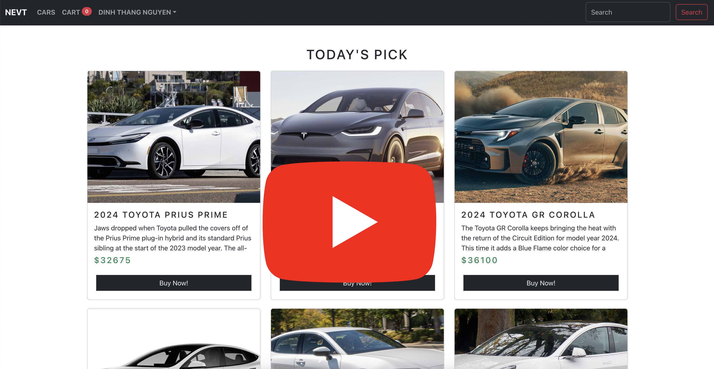

# waa-nevt-fe
WAA New Energy Vehicle Transportation Front End
Project Member:
+ Dinh Thang Nguyen: SID: 616940
+ Giao Hieu Tran: SID: 616944

This is part of the WAA class. ComPro Grad program. Maharishi International University, IA, USA

My team is Dinh Thang (616940) and Giao Hieu (616944). We're working on a fictional NEV (New Energy Vehicle) E-commerce platform. 

here is the git reo of BE (SpringBoot) and BE Testing (Rest Assured): #1
https://github.com/HieuMIU/waa-nevt-be

here is the git repo of FE (React) and FE Testing (Selenium): #2
https://github.com/dinhthangnguyen/waa-nevt-fe

here is our demo video: #3

